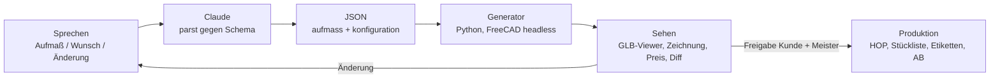

# Konstruktion wird Konversation

**Der Master-Workflow für den Einbauschrank-Konfigurator** — Aufmaß bis Maschine aus einem JSON, bedient per Sprache, gerechnet von deterministischem Code.

---

## 0. Die vier Gesetze

Alles Weitere ist Ableitung aus diesen vier Sätzen. Wenn eine Entscheidung ansteht, entscheidet das Gesetz.

1. **Das JSON ist die Wahrheit.** FreeCAD ist Renderer, nie Bedienoberfläche. 3D, Zeichnung, Stückliste, HOP, Angebot — alles wird generiert, nichts wird gepflegt.
2. **Die KI interpretiert, der Code rechnet.** Claude übersetzt Sprache in JSON, prüft Plausibilität, erklärt Regelverstöße. Jede Koordinate, jede Bohrung, jedes Maß kommt aus deterministischem Python. Keine KI-Zahl erreicht je eine Maschine.
3. **Der Loop ist das Produkt.** Nicht der Konfigurator ist die Innovation, sondern die Geschwindigkeit von „Änderung gesagt" bis „neuer Stand sichtbar". Stirbt die Latenz, stirbt der Workflow.
4. **Gesprochen wird nur die Abweichung.** Die Werkregeln (SCHRANK:WERK) tragen den Standard. Der Dialog benennt nur, was vom Standard abweicht. Deshalb sind die Gespräche kurz und die Ergebnisse vollständig.

---

## 1. Der Kern-Loop



**Latenzbudgets** (hart, nicht verhandelbar — sie sind die UX):

| Schritt | Budget |
|---|---|
| Sprache → validiertes JSON | < 5 s |
| JSON → neuer 3D-Stand (GLB) | < 10 s |
| Änderungs-Diff anzeigen | sofort (aus JSON-Diff, ohne Neugenerierung) |
| Komplettpaket Produktion (HOP, Listen, Zeichnung) | < 60 s |
| Aufmaß → Angebot beim Kunden | gleicher Tag, Ziel: gleicher Termin |

---

## 2. Musk: Der Algorithmus, angewandt aufs Schreinern

Der Fünf-Schritte-Algorithmus, in dieser Reihenfolge und keiner anderen:

**1. Jede Anforderung hinterfragen.**
- „Es braucht eine Werkstattzeichnung pro Teil." — Wirklich? Ein Etikett mit QR-Code, das auf eine Teilseite (3D, Kantenbild, Bohrbild, Einbauort) führt, ersetzt für 90 % der Teile die Papierzeichnung. Die Gesamtzeichnung bleibt — für Freigabe und Montage.
- „Es braucht ein ERP für Angebot und AB." — Nein. Angebot, Auftragsbestätigung und Bestellliste sind Reports aus demselben `bauplan.json`. Doppelte Datenhaltung ist der Fehler, nicht die Lösung.
- „CAD muss man bedienen können." — Nein. CAD ist ab jetzt ein Compiler.

**2. Löschen.** Diese Prozessschritte existieren im neuen Workflow nicht mehr: Aufmaßzettel abtippen, im CAD klicken, Zeichnungen ableiten und nachpflegen, Stückliste händisch schreiben, CNC-Programme am Terminal tippen, Angebotstext formulieren. *Erwartung nach Musk: Was man nie zurückholen muss, hat man zu wenig gelöscht.* Die Teil-Zeichnung für Sichtteile wird vermutlich zurückkommen — aber als generiertes Artefakt, nie als gepflegtes.

**3. Vereinfachen — erst nach dem Löschen.** Ein Datenmodell statt fünf Dateiformate. Eine Handvoll Teiltypen (Seite, Boden, Konstruktionsboden, Rückwand, Front, Schubkasten, Passleiste, Sockel). System-32-Raster als Default. Beschläge als Datensätze, nicht als Code.

**4. Beschleunigen.** Die Taktzeit ist das Feature: klassisch vergehen zwischen Aufmaß und Angebot ein bis zwei Wochen — das Ziel ist *derselbe Termin*. Analog zum „Idiot Index" gilt der **Zeit-Index**: Stunden von Aufmaß bis Angebot, gemessen pro Auftrag, sichtbar gemacht, systematisch gesenkt.

**5. Automatisieren — zuletzt.** Das Meister-Freigabe-Gate bleibt bewusst manuell (Haftung, Sichtprüfung der Bohrbilder). HOP geht erst automatisch an die Maschine, wenn der Diff gegen das RSO-Referenzteil über Wochen null Abweichungen zeigt. Wer Schritt 5 vor Schritt 2 macht, automatisiert seine Fehler.

Zwei Musk-Sätze als Konstruktionsregeln:
- **„Das beste Teil ist kein Teil."** Passleiste nur, wenn die Nischendifferenz die Toleranz übersteigt — der Generator entscheidet das rechnerisch aus dem Mehrpunktmaß, nicht der Reflex („machen wir immer so").
- **„Die Fabrik ist das Produkt."** Das eigentliche Asset ist nicht der einzelne Schrank, sondern Generator + Regelbibliothek. Jeder Auftrag, jede Werkstatt-Rückfrage („warum ist da keine Bohrung?") wird zum Regel-Kandidaten. Das System wird mit jedem Möbel besser — das ist die Maschine, die die Maschine baut.

---

## 3. Bezos: Rückwärts vom Kunden

**Working backwards — die Pressemitteilung zuerst.** So muss sich das Ergebnis anfühlen, alles andere ist Implementierungsdetail:

> *Die Schreinerei misst Ihre Nische aus — per Stimme, in fünf Minuten. Noch vor Ort bekommen Sie einen Link: Ihr Schrank, in Ihrer Nische, in 3D, mit Preis. Sie wünschen sich eine Änderung? Sagen Sie es einfach — Minuten später zeigt derselbe Link den neuen Stand. Ein Klick auf „Freigeben", und die Fertigung beginnt. Kein Aufmaßtermin-Pingpong, keine Wochen Wartezeit auf ein Angebot, keine Zeichnungen, die keiner lesen kann.*

Daraus folgen die Bezos-Prinzipien für dieses System:

- **„Mach es einfacher"** heißt: Schritte streichen, nicht Features stapeln. Der Kunde sieht genau drei Dinge: 3D-Modell, Preis, Freigabe-Knopf. Der Meister sieht mehr — aber erst auf Nachfrage (progressive Offenlegung, Abschnitt 4).
- **Two-way doors schnell, one-way doors sorgfältig.** Regeln, Presets, Exportformate sind umkehrbare Türen — ändern, testen, notfalls zurück. Das Datenmodell (IDs, Referenzstruktur, Einheiten) ist eine Einbahntür — deshalb wird es zuerst und mit der größten Sorgfalt entschieden (Abschnitt 6).
- **Das API-Mandat, übersetzt:** Jede Fähigkeit des Systems existiert nur als MCP-Tool — `aufmass_erfassen`, `schrank_konfigurieren`, `modell_generieren`, `stueckliste`, `hop_export`. Nichts läuft „nur per Hand nebenbei". Was kein Tool ist, existiert nicht. Genau das macht später Kunden-Selbstkonfiguration, MEOS-Integration und Kollegen-Lizenzierung möglich, ohne irgendetwas umzubauen.
- **Das Flywheel:** Mehr Aufträge → mehr Presets und Regeln → schnellere Angebote → günstiger und schneller als jeder Wettbewerber → mehr Aufträge. Der Einsatzpunkt des Schwungrads ist die Regelbibliothek: Sie ist das, was sich dreht.

---

## 4. UI/UX auf Weltklasse-Niveau: acht Regeln

Die beste Oberfläche ist hier keine Oberfläche — aber „keine UI" ist die anspruchsvollste UI von allen. Diese acht Regeln machen den Unterschied zwischen Spielzeug und Werkzeug:

1. **Latenz ist das Interface.** Die unmittelbare Verbindung zwischen Änderung und Ergebnis (Bret-Victor-Prinzip) ist der Grund, warum sich das System magisch anfühlt. Deshalb sind die Budgets aus Abschnitt 1 Gesetz.
2. **Jede Änderung zeigt ihren Diff.** Nach jedem Satz antwortet das System menschenlesbar: *„Element rechts: 940 → 860 mm. Schublade 4: Höhe 180 → 140 mm. 6 Teile geändert, 2 Bohrbilder neu. Preis: −84 €."* Im Viewer leuchten die geänderten Teile. Das ist Code-Review für Möbel — und das Vertrauensfundament des ganzen Systems.
3. **Fehler sind Vorschläge.** Nie „geht nicht", immer Konsequenz plus Optionen: *„Element Mitte wird 940 breit — Boden in 19 mm biegt durch. Option A: Mittelseite (+1 Teil, +38 €). Option B: 25-mm-Boden (+22 €). Welche?"*
4. **Referenz durch Zeigen.** Ein Klick aufs Element im Web-Viewer setzt den Kontext für den nächsten Satz: „die da flacher" funktioniert, weil Chat und Viewer dasselbe Modell teilen. Sprache und direkte Manipulation sind keine Konkurrenten, sondern ein Werkzeug.
5. **Zwei Sichten, ein Modell.** Kundensicht: GLB, Preis, Optionen, Freigabe. Meistersicht: Bohrbilder, Kanten, Passleisten, HOP-Diff. Beides sind nur Filter auf `bauplan.json`.
6. **Verlauf ist Git.** Jeder Stand ein Commit, jede Variante ein Branch, jede Freigabe ein Tag. „Warum ist das so?" ist auch bei einer Reklamation in drei Jahren beantwortbar: Checkout des exakten Stands, Teil neu rendern, vergleichen.
7. **Defaults arbeiten.** Alles Ungesagte füllen die Werkregeln. Der Dialog wird dadurch kurz — Gesetz 4.
8. **Baustellentauglich.** Sprache funktioniert mit Handschuhen und Staub. Kein Empfang in der Nische? Sprachmemo offline aufnehmen, geparst wird später. Das Handy bleibt in der Tasche, der Zollstock in der Hand.

---

## 5. SWOOD & IMOS: klauen wie ein Künstler

Die beiden besten Systeme der Branche haben je eine Kernidee, die Jahrzehnte Praxiswissen kondensiert. Die Ideen werden übernommen — die Umsetzung bewusst nicht.

| Prinzip | Original | Übersetzung ins JSON-System |
|---|---|---|
| **Der Beschlag trägt seine Bearbeitung** | SWOOD: Beschlag platzieren → Bohrungen entstehen auf allen beteiligten Teilen | `beschlaege/*.json`: jeder Beschlag ist ein Datensatz aus Geometrie + Bohrbild + Platzierungsregeln. Der Generator wendet ihn an — das Bohrbild „gehört" dem Beschlag, nie dem Teil |
| **Die Box passt sich der Öffnung an** | SWOOD-Box: parametrische Unterbaugruppe, die sich in jede Kavität einsetzt | `preset`: `kleiderstange.doppelt`, `schubladen`, `boeden` — einmal definiert, in jeder Elementbreite verwendbar |
| **Raumaufteilung über Regeln, Teile folgen** | SWOOD-Frames: das Skelett verteilt den Raum, Platten passen sich an | `elemente[].breite: "auto"` — der Generator verteilt die Nischenbreite nach Regeln (Fachbreiten-Grenzen, gleichmäßige Fugen) |
| **Kante als Eigenschaft mit Maßabzug** | SWOOD: Kantenmaterial am Teil, Zuschnitt automatisch korrigiert | Kante ist Attribut im `bauplan.json`, der Maßabzug ist Generator-Arithmetik — nie Kopfrechnen |
| **Verbindung als Prinzip, nicht als Bohrung** | IMOS-Konstruktionsprinzipien: Verbindungsregel zwischen Teilpaaren; Prinzip ändern → alle Artikel folgen | `werkregeln.verbindungen`: „Konstruktionsboden ↔ Seite = Exzenter" gilt deklarativ für alle Paare. Eine Regeländerung wirkt auf jeden künftigen Schrank |
| **Order-to-machine: eine Quelle** | IMOS: ein Datenmodell vom Verkauf bis zur Maschine | Exakt das JSON-Prinzip — Angebot, AB, Etikett, HOP aus einer Datei |
| **Artikel = Parameter + Regeln** | IMOS-Variantenlogik: keine gespeicherte Geometrie, nur Erzeugungsvorschrift | `konfiguration.json` speichert Absicht, nie Geometrie. Geometrie ist immer Ableitung |
| **Der Raum ist ein Objekt** | IMOS-Raumplanung: Wände, Nischen, Hindernisse | `aufmass.json`: Nische mit Mehrpunktmaßen, Steckdosen, Sockelleisten als strukturierte Hindernisse |
| **Kunde konfiguriert auf demselben Modell** | imos NET: Web-Konfigurator speist die Produktionsdaten | Kunden-Viewer + Freigabe heute, geführter Kunden-Dialog morgen — gleiche Datei, anderer Filter |

**Was bewusst anders läuft** — und warum genau darin die Einzigartigkeit liegt:

| SWOOD / IMOS | Dieses System |
|---|---|
| Bedienung: Klicks, Schulungswochen | Sprache und Dialog — Anlernzeit null |
| Regeln in proprietärer Datenbank | Werk-DNA als lesbares JSON im Git-Repo |
| Lizenzkosten fünfstellig, pro Platz | FreeCAD headless, Grenzkosten ≈ 0 |
| Läuft am CAD-Arbeitsplatz | Läuft überall: Baustelle, Handy, Chat |
| Änderung = Termin am Rechner | Änderung = ein Satz, neuer Stand in Sekunden |
| Wissen steckt im Bediener | Wissen steckt in versionierten Regeln |

**Der Moat in einem Satz:** Werk-DNA als offene Daten × KI als Bediener × Determinismus als Vertrauen. Jede der drei Zutaten gibt es einzeln — die Kombination hat niemand.

---

## 6. Das Datenmodell — die Entscheidung, an der alles hängt

Vier Dateien, strikte Gewaltenteilung. **Wunsch, Wissen, Ist und Ableitung werden nie vermischt** — das ist die eine Einbahntür-Entscheidung des Projekts:

```
aufmass.json        # IST     — der Raum, wie er wirklich ist (Mehrpunktmaße, Hindernisse)
konfiguration.json  # WUNSCH  — was gebaut werden soll (Elemente, Presets, Abweichungen)
werkregeln.json     # WISSEN  — die Werk-DNA (SCHRANK:WERK-Regeln, Beschläge, Grenzen)
bauplan.json        # ABLEITUNG — generiert, read-only: alle Teile, Maße, Kanten, Bohrungen
```

- **`aufmass.json`** — nach Erfassung eingefroren; Korrekturen sind neue Versionen, nie Überschreibungen. Fehlende Angaben stehen als `null` plus offener Punkt im Protokoll — der Parser rät nie.
- **`konfiguration.json`** — rein semantisch: IDs, Presets, Parameter. **Enthält per Schema keine Koordinaten** — damit ist das KI-Koordinatenverbot technisch erzwungen, nicht nur vereinbart.
- **`werkregeln.json` + `beschlaege/`** — auftragsunabhängig, selten geändert, jede Änderung ein Commit mit Begründung. Das ist die Datei, die das Flywheel dreht.
- **`bauplan.json`** — wird bei jeder Generierung komplett neu erzeugt und trägt die Hashes seiner drei Inputs. Weder Mensch noch KI editieren diese Datei. Jede Zahl in Angebot, Zeichnung, Etikett und HOP stammt von hier.

Grundsätze, die im Schema festgeschrieben werden:

1. **IDs statt Positionen:** `element.rechts.schublade.1` — sprechbar, klickbar, diffbar. „Mach die oberste Schublade flacher" adressiert eine ID, keinen Index.
2. **Einheit mm, Zahlen als Zahlen,** Schema-Version im Kopf jeder Datei, Migrationen von Version 0.1 an eingeplant.
3. **Determinismus:** gleicher Input → byte-gleicher Output (sortierte Schlüssel, feste Rundung). Nur so funktionieren Diff, Cache und Golden-Tests.
4. **Reproduzierbarkeit:** Der QR-Code auf jedem Etikett kodiert Auftrag + Commit-Hash. Jedes je gefertigte Teil ist Jahre später exakt regenerierbar.

Beispiel-Skeletons liegen in [`beispiele/`](beispiele/) — mit genau der Nische und der Konfiguration aus dem Ursprungs-Szenario (2482/2478, doppelte Kleiderstange links, fünf Böden Mitte, vier Schubladen rechts, grifflos).

---

## 7. Architektur: dünn, deterministisch, testbar

```
┌─────────────────────────────────────────────────────────┐
│  Claude (Desktop-Chat, App, Voice)                      │   interpretiert, fragt nach, erklärt
├─────────────────────────────────────────────────────────┤
│  MCP-Server `moebel-cad` (dünn, zustandslos)            │   aufmass_erfassen · schrank_konfigurieren ·
│                                                         │   modell_generieren · stueckliste · hop_export
├─────────────────────────────────────────────────────────┤
│  Kern (Python, deterministisch)                         │   Schema-Validator → Regel-Engine → Generator
│  FreeCAD headless als Geometrie-Backend                 │   (Solids, Bohrbilder, Nuten, Passleisten)
├─────────────────────────────────────────────────────────┤
│  Exporte                                                │   GLB · TechDraw/PDF · Stückliste · Kantenliste ·
│                                                         │   Etiketten+QR · Bestellliste · HOP je Teil · AB
├─────────────────────────────────────────────────────────┤
│  Kanäle                                                 │   Kunden-Viewer (Link) · Werkstatt (Teilseite via
│                                                         │   QR) · Maschine (HOP) · MEOS
└─────────────────────────────────────────────────────────┘
```

**Der Anti-Halluzinations-Vertrag** (hart verdrahtet, nicht Konvention):

1. Die KI schreibt ausschließlich `aufmass.json` und `konfiguration.json`, immer gegen Schema validiert. Ablehnung → Rückfrage an den Menschen, nie stilles Raten.
2. Das Konfigurations-Schema kennt keine Koordinaten — eine halluzinierte Bohrung ist damit strukturell unmöglich, nicht bloß verboten.
3. Jede Zahl in jedem Output stammt aus `bauplan.json`, und `bauplan.json` stammt ausschließlich aus dem Generator.
4. HOP-Dateien erreichen die Maschine erst nach bestandenem Diff (siehe CI) und Meister-Freigabe.

**Möbel-CI** — Software-Praxis, die es in der Branche schlicht nicht gibt, und die hier gratis mitkommt:

- **Golden-Tests:** Ein Satz Referenzschränke wird bei jedem Commit an Regeln oder Generator neu generiert und muss byte-gleich bleiben — jede Abweichung ist sichtbar und gewollt oder ein Bug.
- **Property-Tests über zufällige Nischen und Konfigurationen:** keine Bohrung außerhalb ihres Teils, Mindestabstände eingehalten, keine Teilkollisionen, Summe der Elementbreiten = Nischenbreite minus Ausgleich.
- **HOP-Diff gegen das RSO-Referenzteil:** null Toleranz, maschinell geprüft, Bestehen ist Voraussetzung für den Produktionspfad.

---

## 8. Der Workflow in neun Schritten

| # | Schritt | Was passiert | Wer/Was arbeitet |
|---|---|---|---|
| 0 | **Werk-DNA erfassen** (einmalig) | SCHRANK:WERK-Regeln, Beschlagbibliothek, Presets als JSON anlegen | Meister + Claude im Dialog |
| 1 | **Aufmaß per Sprache** | Diktat auf der Baustelle → `aufmass.json` mit Mehrpunktmaßen, Hindernissen, offenen Punkten. Foto als Doku dazu | Claude parst, Schema validiert |
| 2 | **Konfiguration im Dialog** | Wunsch → `konfiguration.json`; Regel-Gates lösen Rückfragen aus (Fachbreite, Biegung, Bänderseite) | Claude übersetzt, Regel-Engine prüft |
| 3 | **Generierung** | Beide JSONs + Werkregeln → `bauplan.json` → GLB, Zeichnung, Preis. Unter 10 Sekunden | Generator, headless |
| 4 | **Änderungsschleife** | Jeder Satz erzeugt neuen Stand + menschenlesbaren Diff + Preisdelta | Loop aus 2–3 |
| 5 | **Kunden-Loop** | Link mit 3D-Viewer, Preis, Freigabe-Knopf; Kommentare fließen als Änderungswünsche in den Chat | Kunde, asynchron |
| 6 | **Meister-Gate** | Eine menschliche Freigabe: Bohrbilder, Passleisten, Plausibilität. Bewusst nicht automatisiert | Meister |
| 7 | **Produktion auf Knopfdruck** | HOP je Teil, Stückliste, Kantenliste, Etiketten mit QR, Beschlag-Bestellliste, Montageplan, Angebot/AB | Export-Pipeline |
| 8 | **Rückkopplung** | As-built-Abweichungen zurück ins JSON; jede Werkstatt-Rückfrage wird Regel-Kandidat | Flywheel (Abschnitt 3) |

Schritt 8 ist der unscheinbarste und der wichtigste: Er ist der Unterschied zwischen einem Tool und einem System, das jeden Monat besser wird.

---

## 9. Etappenplan mit Definition of Done

Erst ab Stufe 3 fertigt das System real — bis dahin läuft es parallel zum bestehenden Prozess mit („Schatten-Betrieb"), jeder Unterschied wird untersucht.

| Stufe | Inhalt | Definition of Done |
|---|---|---|
| **1** — Wochenende | Schema v0.1 (alle vier Dateien) + Generator für rohen Korpus (ohne Bohrungen) | Beispiel-Nische → Korpus stimmt sichtbar in FreeCAD · Regeneration < 10 s · gleicher Input → byte-gleicher Output |
| **2** | SCHRANK:WERK-Regeln, Beschlagbibliothek, Nischenausgleich, Kanten, Verbindungen | Ein realer Auftrag im Schatten-Betrieb: generierte Bohrbilder identisch mit Handarbeit · Regelverstöße erzeugen verständliche Rückfragen |
| **3** | Exporte: HOP, Stückliste, Kantenliste, Etiketten; Möbel-CI steht | HOP-Diff gegen RSO-Referenzteil = 0 Abweichungen · ein Teil real gefräst und verbaut · Golden- und Property-Tests laufen bei jedem Commit |
| **4** | MCP-Server `moebel-cad`, Voice-Aufmaß, Kunden-Viewer, Preis-Report | Ein kompletter Auftrag ohne einen einzigen CAD-Klick · Aufmaß → Angebot am selben Tag · Kunde gibt über den Link frei |

**Kennzahlen, ab Tag 1 gemessen** (der Zeit-Index aus Abschnitt 2):

- Aufmaß → Angebot: Ziel gleicher Tag (klassisch: 1–2 Wochen)
- Änderung → neuer Stand: < 60 s
- Manuelle Koordinaten-/Maßeingaben pro Auftrag: 0
- Maßbedingte Reklamationen: → 0 (Mehrpunktmaß + rechnerischer Ausgleich)

---

## 10. Disruptionsradar — was danach kommt

In ehrlicher Reihenfolge der Machbarkeit, jeweils ohne Umbau, weil alles auf denselben Dateien und Tools sitzt:

1. **Werker-UX:** Etikett scannen → Teilseite am Handy: 3D-Teil, Bohrbild, Kanten, Einbauort, Montageschritt. Klein zu bauen, riesig im Alltag.
2. **Kunde konfiguriert selbst** im geführten Dialog — dieselben Regel-Gates schützen vor Unfug, der Meister gibt weiter frei. Das ist imos NET, aber als Gespräch statt Formular.
3. **AR-Vorschau:** das GLB in der echten Nische betrachten, bevor gefertigt wird.
4. **Foto/LiDAR-Aufmaß** als Plausibilitätsprüfung — der Laser-Entfernungsmesser und das Diktat bleiben die Wahrheit (Millimeter schlagen Zentimeter), der Scan dokumentiert und warnt.
5. **Die Werk-DNA als Produkt:** Regeln, Presets und Beschlagbibliothek sind versionierte Daten — lizenzierbar an Kollegen, teilbar im MEOS-Netz. Aus der Schreinerei wird ein Plattformbetrieb: „SCHRANK:WERK inside".

Punkt 5 ist die eigentliche Disruption: SWOOD und IMOS verkaufen Software, in die jeder Betrieb sein Wissen erst hineinklicken muss. Hier ist das Wissen selbst das Produkt — und der Vertriebskanal ist ein Git-Repo.

---

## 11. Leitplanken

- **FreeCAD-Version pinnen** (Container-Image) — ein Geometrie-Kernel-Update darf nie unbemerkt Maße ändern; die Golden-Tests fangen den Rest.
- **Schema-Migrationen von v0.1 an** — alte Aufträge müssen mit neuen Schemas regenerierbar bleiben (Reklamationsfall).
- **Toleranzketten dokumentieren:** Wo entsteht Ausgleich (Passleiste, Stellfuß, Fuge), wo wird gemessen, wo gerundet — als Kommentarfeld in den Werkregeln, nicht als Kopfwissen.
- **Haftung:** Das Meister-Gate ist kein technisches Provisorium, sondern Bestandteil des Systems. Automatisiert wird die Arbeit, nicht die Verantwortung.
- **KI-Disziplin:** Rückfrage schlägt Annahme. Ein Parser, der bei „Steckdose links unten 300" die fehlende Höhe still erfindet, ist ein Bug — auch wenn er meistens richtig rät.

---

*Nächster Schritt: Stufe 1 — Schema v0.1 festziehen (die Skeletons in `beispiele/` sind der Startpunkt) und den Korpus-Generator bauen.*
